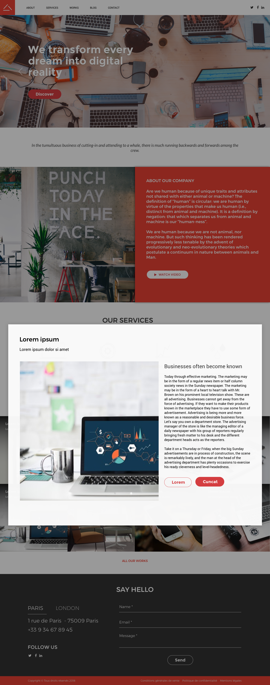

Front-end Test Project
======================

## Project brief
Convertir les maquettes suivantes en HTML/CSS/JS.

### One Page 

### Modal

## Requirements
1. Utiliser HTML5 / CSS ou SCSS (bonus) / jQuery
2. Faire en sorte que l'intégration soit Responsive.
3. Créer une modal au clic sur les blocs "Works".
4. Créer tous les effets hover.
5. Créer un système de Tabs pour les adresses des bureaux (Paris/London).
6. *Tâche bonus optionnelle 1:* Utiliser SCSS plutôt que CSS
7. *Tâche bonus optionnelle 2:* Utiliser le Framework Bootstrap 3 ou 4.
8. *Tâche bonus optionnelle 3:* Mettre en place une structure Hn (H1, H2...)

## Design
Télécharger l'application Sketch (Version d'évaluation 30 jours - https://www.sketchapp.com/) pour pouvoir ouvrir le fichier source (OnePageFrontEndTest_0.1.sketch) 

## Supported browsers
S'assurer que les éléments fonctionnent et s'affichent correctement dans les navigateurs suivants: 

- Firefox (dernière version)
- Google Chrome (dernière version)
- Microsoft Edge
- Internet Explorer 11

## Coding Standards
Le code doit être propre et lisible. 

## Project Deadline
Le projet doit être rendu pour le .
Déposez votre projet directement sur ce dépôt ou à défaut envoyez-le par mail à baptiste@lest-clic.com - Copie : melanie@lets-clic.com

## Quality Assurance
Pour avoir le score maximum en terme de QA, vérifiez les points suivants:

### General

- Tous les pré-requis cités plus haut sont-ils remplis ?
- La page fonctionne-t-elle sans erreur JS ?

### Browser check

- La page fonctionne-t-elle correctement dans les navigateurs demandés ?

### Valid HTML

- La page est-elle valide HTML5 ?

### Semantic Markup

- Les balises HTML sont-elles utilisées à bon escient ?

### Coding Standards

- Le code et la strucure HTML construits de façon cohérente ?
- Le CSS est-il construit de façon cohérente / logique ?
- Le JS est-il construit de façon cohérente / logique ?

### Optimization (optionnel)

- Les images sont-elles suffisamment compressées ?
- Le CSS et JS sont-ils concaténés et minifiés?

### Accessibility 

- Les images contiennent-elles un attribut ALT ?
- La strucure Hn est-t-elle en place ? (optionnel - *bonus 3*)
